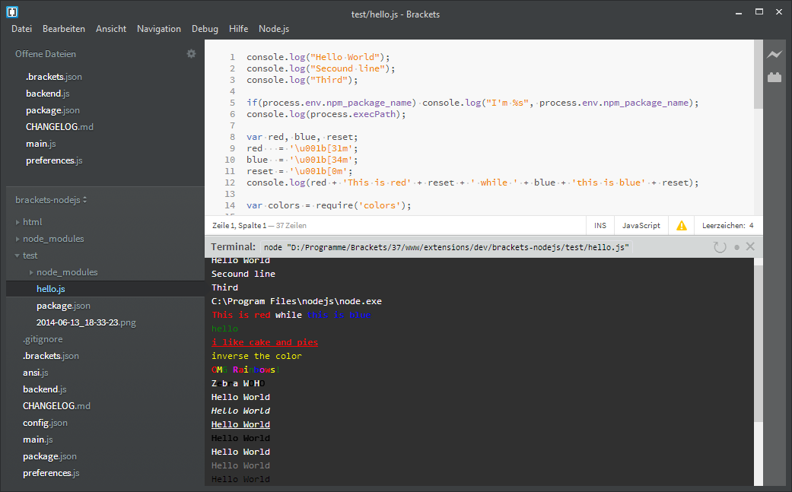

#Brackets-Node.js (Node.js bindings)
... is an extension for Brackets to run Node.js or NPM files directly from Brackets.

## Usage
Use the new added menu `Node.js`.

* `Run` runs the current opened file using node, e.g. `node /home/User/nodejs/server.js`
* `Run as npm ...` will execute the command inside the directory of the current opened file, e.g. `cd /home/User/nodejs && npm start`

When node process should be stopped we send a `SIGTERM` to "kill" them.

## Installation

Use the extension manager (File > Extension Manager) and search for `node.js`.
There you can install `Node.js bindings`.

*From GitHub (newest version):*
`File` > `Extension Manager` > `Install from URL` > `http://github.com/Acconut/brackets-nodejs` > `Install`

And boom.
